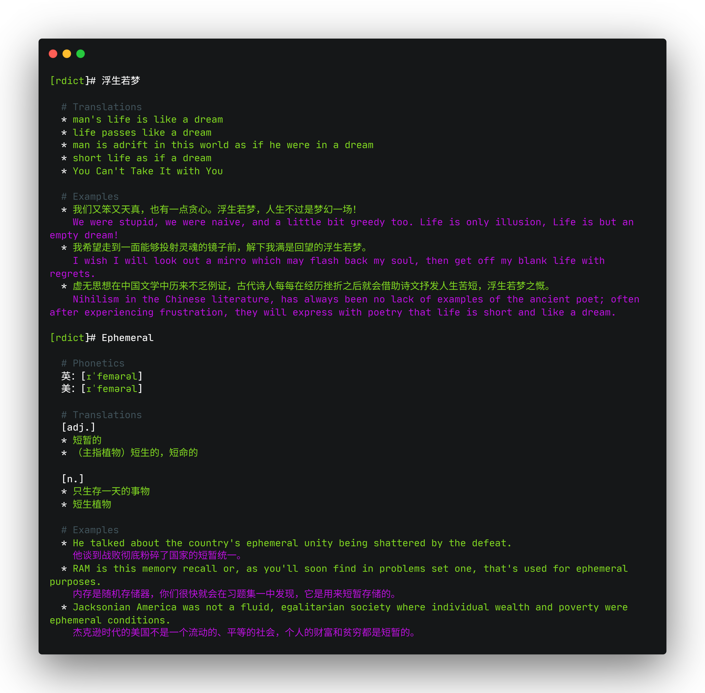

# Rdict

> [!WARNING]
> This is a beginner's project to learn and practice Rust, expect terrible rust code and chaotic `unwrap()`s.

A fast, terminal-based Youdao dictionary client written in Rust.

---

### Features

- The classic “blazingly fast” — complete with unnecessary 🦀 spam, just like every other Rust project
- Cached translation results
- Interactive mode

---

### Preview

---

### Similar Projects

- https://github.com/TimothyYe/ydict
- https://github.com/felixonmars/ydcv
- https://github.com/farseerfc/ydcv-rs
- https://github.com/eatradish/ydcv-saki
